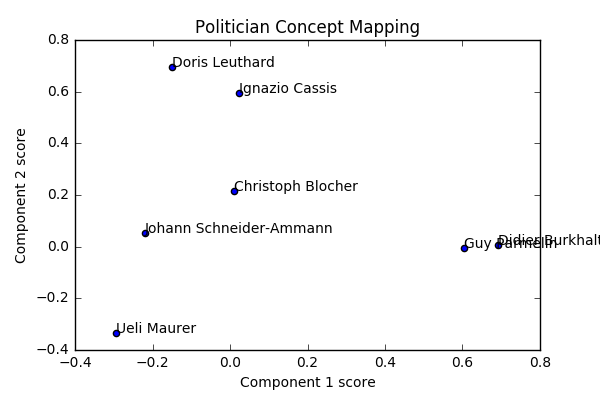

# Parlament

This work was done in the context of the [Data Jam Days](http://datajamdays.org/) at EPFL
(*24-25 Nov 2017*).

## Intro

The Swiss confederation provides a large amount of data spanning virtually
every aspect of the political process in Switzerland. With a convenient API
to query the proceedings of committees, councillors, parties, logs of voting sessions ...

From this massive resource we decided to study voting patterns in the Swiss
government.

## Main contribution

> Our insight was that voting patterns can be considered as a recommender
system : the user-item interaction matrix is a politician-vote interaction
matrix.

The attractiveness of this method is that we get some insights "for free".
The matrix completion setting allows for vote prediction : we can guess how
likely a politician is to vote yes/no on an issue given his voting record and
the voting record of his peers.
In the matrix factorisation setting we compute a latent space representation
of the politicians and the votes : these factors can represent some higher level
characteristics, embedded within the observations. We can compute similarities
or correlations in these higher dimensional spaces to get insight on the voting
patterns.

## Data
### Initial research

We first applied our analysis to the subset of the 7 federal councillors. We
scraped their complete voting records, and started designing our data exploration
pipeline on this set.

### Full data exploration

We then scraped the councillors representing 4 major parties of Switzerland * :

* PLR
* UDC
* PS
* Verts

This represents 175 councillors and 1718 voting instances.

\* *This is an arbitrary choice, no preferences expressed :)*

## Results and insights

## Future work

There are many other projects that can be attempted with this data. Some ideas
for exploration include :

* Predicting the voting behaviour of politicians
* Use topic extraction to get insight about the content of the issues
    * Which are the most divisive issues ?
    * What issues are most representative of a party ?
    * What are the most important / the most engaging issues being discussed ?
* Study the temporal evolution of issues, voting patterns, divisions in the political spectrum ...
* More fine grained differentiation of the difference in voting pattern

If you feel like attempting these or know of projects that have done this in the
past, feel free to contact us !

## Resources

* [Github](https://github.com/lazareGirardin/DataJamDays)
* [Data source](http://ws-old.parlament.ch/)

## License

This work is distributed with a [GPLv3 License](https://www.gnu.org/licenses/gpl.html).

---

## Authors
* Dylan Bourgeois ([@dtsbourg](https://twitter.com/dtsbourg))
* Lazare Girardin (@lazareGirardin)
* Louis Duvigneau (@loduv)
