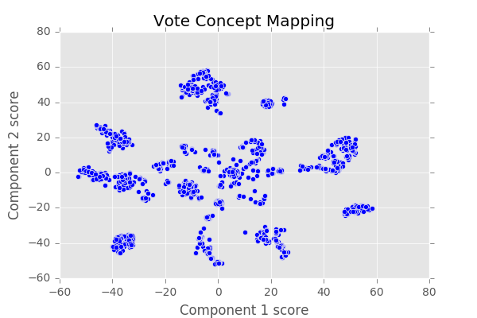
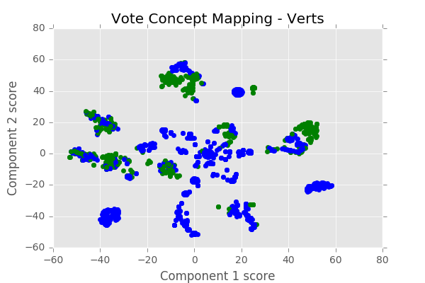
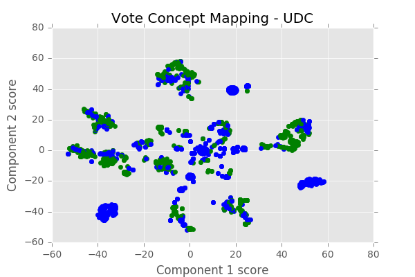
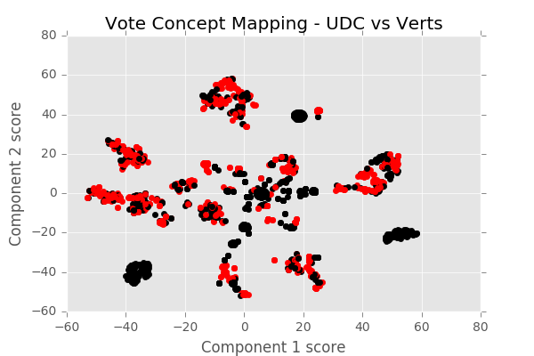
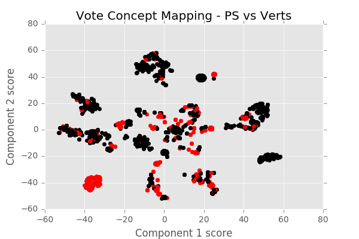

# Parlament

This work was done in the context of the [Data Jam Days](http://datajamdays.org/) at EPFL
(*24-25 Nov 2017*).

## Intro

The Swiss confederation provides a large amount of data spanning virtually
every aspect of the political process in Switzerland. With a convenient API
to query the proceedings of committees, councillors, parties, logs of voting sessions ...

From this massive resource we decided to study voting patterns in the Swiss
government.


## Main contribution

> Our insight was that voting patterns can be considered as a recommender
system : the user-item interaction matrix is a politician-vote interaction
matrix.

The attractiveness of this method is that we get some insights "for free".
The matrix completion setting allows for vote prediction : we can guess how
likely a politician is to vote yes/no on an issue given his voting record and
the voting record of his peers.
In the matrix factorisation setting we compute a latent space representation
of the politicians and the votes : these factors can represent some higher level
characteristics, embedded within the observations. We can compute similarities
or correlations in these higher dimensional spaces to get insight on the voting
patterns.

## Data
### Initial research

We first applied our analysis to the subset of the 7 federal councillors. We
scraped their complete voting records, and started designing our data exploration
pipeline on this set.

### Full data exploration

We then scraped the councillors representing 4 major parties of Switzerland * :

* PLR (Parti Libéral Radical) / FDP (The Liberals)
* UDC (Union Démocratique Chrétienne)
* PS (Parti Socialiste)
* Verts

This represents **175 councillors** and **1718 voting instances**.

A voting instance is considered to be the discussion of an article of law. There
are several possible states for each councillor's voting behaviour on the issue :

* `Yes`
* `No`
* `P`  = President of the concerned committee (can't vote)
* `EH` = Abstained
* `ES` = Absent
* `NT` = did not participate

\* *This is an arbitrary choice, no preferences expressed :)*

## Results and insights

The main results of the Data Jam Days focus on the representation of voting
in the Swiss parliament. They were projected into a 7 dimensional latent space
and plotted by reducing down to 2 dimensions with [t-SNE](https://lvdmaaten.github.io/tsne/).



*Figure 1 : Clusters of voting instances*

The voting patterns are overlayed with a party's voting behaviour. Convention
is to use the color green for a `Yes` vote and blue for any other voting behaviour.
The party's line is chosen with a positive bias : if at least one of the members
voted `Yes` it is considered the party line. This metric will be adapted in a more
refined analysis.



*Figure 2 : Clusters of voting instances with voting behaviour (Green party)*



*Figure 3 : Clusters of voting instances with voting behaviour (UDC party)*

We now highlight conflicting behaviours, colouring in red instances in which a pair of
parties has voted oppositely (again, only one conflicting vote is sufficient to
tag the vote as such) and in black instances in which parties have voted unanimously.



*Figure 4 : Clusters of voting instances highlighting conflicting voting patterns (Green vs UDC)*

There are many conflicting cases between the Green party and the UDC party, as can be expected
from dramatically different political lines.



*Figure 5 : Clusters of voting instances highlighting conflicting voting patterns (Green vs PS)*

PS and Green party are much closer ideologically : they often vote the same thing.
Nevertheless we notice a cluster of diverging opinions, which can be identified in
a more detailed analysis.

## Future work

There are many other projects that can be attempted with this data. Some ideas
for exploration include :

* Predicting the voting behaviour of politicians
* Use topic extraction to get insight about the content of the issues
    * Which are the most divisive issues ?
    * What issues are most representative of a party ?
    * What are the most important / the most engaging issues being discussed ?
* Study the temporal evolution of issues, voting patterns, divisions in the political spectrum ...
* More fine grained differentiation of the difference in voting pattern

*If you feel like attempting these or know of projects that have done this in the
past, feel free to contact us !*

## Resources

* [Github](https://github.com/lazareGirardin/DataJamDays)
* [Data source](http://ws-old.parlament.ch/)
* [Data set (`.pkl`)\*](https://github.com/lazareGirardin/DataJamDays/blob/master/parlement_votes_5pages.pkl)

\* You can read this format from [within the notebook](https://pandas.pydata.org/pandas-docs/stable/generated/pandas.read_pickle.html)

## Repository Structure

* `data` : contains the dataset used in this project.
* `img` : figures generated to illustrate our work.
* `lib` : code utilities used in the project.
* `notebook` : IPython Notebook used to run the exploration.

Before running the project, you must install the requirements :

```bash
sudo pip install -r requirements.txt
```

You can then start up a Jupyter Notebook and explore the data in the
provided notebooks :

```bash
jupyter notebook
```

## License

This work is distributed with a [GPLv3 License](https://www.gnu.org/licenses/gpl.html).

---

## Authors
* Dylan Bourgeois ([@dtsbourg](https://twitter.com/dtsbourg))
* Lazare Girardin (@lazareGirardin)
* Louis Duvigneau (@loduv)
